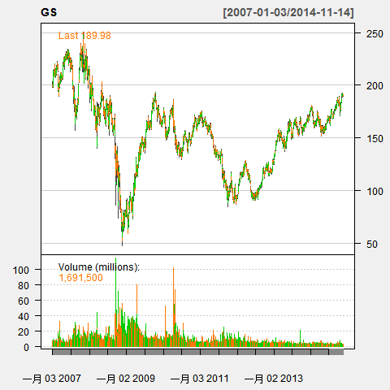

## 3 图形分析

### 3.1 基本画图函数

#### chartSeries

chartSeries()函数是quantmod包的主绘图函数。

该函数的主要参数有：

* x：时序数据
* type:画图的类型
* TA：技术分析指标
* pars:图形参数
* theme:主题

比如：

``` r
> getSymbols("GS") #Goldman OHLC from yahoo 
[1] "GS"
> chartSeries(GS) 
```


#### reChart

reChart()是一个重新绘图函数。

```r
chartSeries(GS) 
reChart(major.ticks='months',subset='first 16 weeks') 
```

### 3.2 三种基本图形
#### 条形图

```r
barChart(GS,theme='white.mono',bar.type='hlc')
```


#### 蜡烛图

```r
candleChart(GS,multi.col=TRUE,theme='white') 
candleChart(GS,multi.col=T,theme="white")
```

#### 线图

```r
lineChart(GS)
lineChart(GS,theme="white")
lineChart(GS,line.type='h',TA=NULL) 
```


### 3.3 修饰图形

通过chartSeries中的图形参数还可以对图形进行修饰。

#### 修饰图形

``` r
## 将图形主题修改为white
chartSeries(GS,theme="white") 
```


#### 定制绘图主题

借助chartSeries函数中的theme函数可以替换绘图主题，如果对当前绘图主题不满意的话，可以通过chartTheme函数进行定制。通过chartTheme函数可以定制的元素如下：

* fg.col:前景色
* bg.col:背景色
* grid.col:网格线颜色
* border:框线颜色
* minor.tick:最小刻度标记的颜色
* major.tick:最大刻度标记的颜色
* up.col:上涨日对应的条形或蜡烛图颜色
* dn.col:下跌日对应的条形或蜡烛图颜色
* up.up.col:连续上涨日的条形或者蜡烛图颜色
* up.dn.col:先涨后跌日的条形或者蜡烛图颜色
* dn.dn.col:连续下跌日的条形或者蜡烛图颜色
* dn.up.col:先跌后涨日的条形或者蜡烛图颜色
* up.border:上涨日对应的条形或者蜡烛图边框线颜色
* dn.border:下跌日对应的条形或者蜡烛图边框线颜色
* up.up.border:连续上涨日对应的条形或者蜡烛图颜色
* up.dn.border:先涨后跌日对应的条形或者蜡烛图颜色
* dn.dn.border:连续下跌日对应的条形或者蜡烛图颜色
* dn.up.border:先跌后涨日对应的条形或者蜡烛图颜色

举个例子，先看看当前主题

``` r
> chartTheme()
List of 27
 $ fg.col      : chr "#666666"
 $ bg.col      : chr "#222222"
 $ grid.col    : chr "#303030"
 $ border      : chr "#666666"
 $ minor.tick  : chr "#303030"
 $ major.tick  : chr "#AAAAAA"
 $ up.col      : chr "#00FF00"
 $ dn.col      : chr "#FF9900"
 $ dn.up.col   : chr "#888888"
 $ up.up.col   : chr "#FFFFFF"
 $ dn.dn.col   : chr "#FF0000"
 $ up.dn.col   : chr "#000000"
 $ up.border   : chr "#666666"
 $ dn.border   : chr "#666666"
 $ dn.up.border: chr "#666666"
 $ up.up.border: chr "#666666"
 $ dn.dn.border: chr "#666666"
 $ up.dn.border: chr "#666666"
 $ main.col    : chr "#999999"
 $ sub.col     : chr "#999999"
 $ area        : chr "#252525"
 $ fill        : chr "#282828"
 $ Expiry      : chr "#383838"
 $ BBands.col  : chr "red"
 $ BBands.fill : chr "#282828"
 $ BBands      :List of 2
  ..$ col : chr "red"
  ..$ fill: chr "#282828"
 $ theme.name  : chr "black"
 - attr(*, "class")= chr "chart.theme"
```

看看white主题的内容：

```r
> chartTheme('white')
List of 24
 $ fg.col      : chr "#000000"
 $ bg.col      : chr "#F0F0F0"
 $ grid.col    : chr "#CCCCCC"
 $ border      : chr "#444444"
 $ minor.tick  : chr "#888888"
 $ major.tick  : chr "#000000"
 $ up.col      : chr "#00CC00"
 $ dn.col      : chr "#FF7700"
 $ dn.up.col   : chr "#888888"
 $ up.up.col   : chr "#FFFFFF"
 $ dn.dn.col   : chr "#FF0000"
 $ up.dn.col   : chr "#000000"
 $ up.border   : chr "#444444"
 $ dn.border   : chr "#444444"
 $ dn.up.border: chr "#444444"
 $ up.up.border: chr "#444444"
 $ dn.dn.border: chr "#444444"
 $ up.dn.border: chr "#444444"
 $ main.col    : chr "#555555"
 $ sub.col     : chr "#555555"
 $ area        : chr "#FFFFFF"
 $ fill        : chr "#F7F7F7"
 $ Expiry      : chr "#C9C9C9"
 $ theme.name  : chr "white"
 - attr(*, "class")= chr "chart.theme"
```

修改white主题中的上涨日对应的条形或蜡烛图颜色，下跌日对应的条形或蜡烛图颜色。

``` r
> chartTheme('white',up.col='blue',dn.col='red')
List of 24
 $ fg.col      : chr "#000000"
 $ bg.col      : chr "#F0F0F0"
 $ grid.col    : chr "#CCCCCC"
 $ border      : chr "#444444"
 $ minor.tick  : chr "#888888"
 $ major.tick  : chr "#000000"
 $ up.col      : chr "blue"
 $ dn.col      : chr "red"
 $ dn.up.col   : chr "#888888"
 $ up.up.col   : chr "#FFFFFF"
 $ dn.dn.col   : chr "#FF0000"
 $ up.dn.col   : chr "#000000"
 $ up.border   : chr "#444444"
 $ dn.border   : chr "#444444"
 $ dn.up.border: chr "#444444"
 $ up.up.border: chr "#444444"
 $ dn.dn.border: chr "#444444"
 $ up.dn.border: chr "#444444"
 $ main.col    : chr "#555555"
 $ sub.col     : chr "#555555"
 $ area        : chr "#FFFFFF"
 $ fill        : chr "#F7F7F7"
 $ Expiry      : chr "#C9C9C9"
 $ theme.name  : chr "white"
 - attr(*, "class")= chr "chart.theme"
```

还可以修改技术指标对应的图形元素。

``` r
# A TA example
> chartTheme(addRSI.col='red')
List of 28
 $ fg.col      : chr "#666666"
 $ bg.col      : chr "#222222"
 $ grid.col    : chr "#303030"
 $ border      : chr "#666666"
 $ minor.tick  : chr "#303030"
 $ major.tick  : chr "#AAAAAA"
 $ up.col      : chr "#00FF00"
 $ dn.col      : chr "#FF9900"
 $ dn.up.col   : chr "#888888"
 $ up.up.col   : chr "#FFFFFF"
 $ dn.dn.col   : chr "#FF0000"
 $ up.dn.col   : chr "#000000"
 $ up.border   : chr "#666666"
 $ dn.border   : chr "#666666"
 $ dn.up.border: chr "#666666"
 $ up.up.border: chr "#666666"
 $ dn.dn.border: chr "#666666"
 $ up.dn.border: chr "#666666"
 $ main.col    : chr "#999999"
 $ sub.col     : chr "#999999"
 $ area        : chr "#252525"
 $ fill        : chr "#282828"
 $ Expiry      : chr "#383838"
 $ BBands.col  : chr "red"
 $ BBands.fill : chr "#282828"
 $ BBands      :List of 2
  ..$ col : chr "red"
  ..$ fill: chr "#282828"
 $ theme.name  : chr "black"
 $ addRSI.col  : chr "red"
 - attr(*, "class")= chr "chart.theme"
> str(chartTheme())
List of 27
 $ fg.col      : chr "#666666"
 $ bg.col      : chr "#222222"
 $ grid.col    : chr "#303030"
 $ border      : chr "#666666"
 $ minor.tick  : chr "#303030"
 $ major.tick  : chr "#AAAAAA"
 $ up.col      : chr "#00FF00"
 $ dn.col      : chr "#FF9900"
 $ dn.up.col   : chr "#888888"
 $ up.up.col   : chr "#FFFFFF"
 $ dn.dn.col   : chr "#FF0000"
 $ up.dn.col   : chr "#000000"
 $ up.border   : chr "#666666"
 $ dn.border   : chr "#666666"
 $ dn.up.border: chr "#666666"
 $ up.up.border: chr "#666666"
 $ dn.dn.border: chr "#666666"
 $ up.dn.border: chr "#666666"
 $ main.col    : chr "#999999"
 $ sub.col     : chr "#999999"
 $ area        : chr "#252525"
 $ fill        : chr "#282828"
 $ Expiry      : chr "#383838"
 $ BBands.col  : chr "red"
 $ BBands.fill : chr "#282828"
 $ BBands      :List of 2
  ..$ col : chr "red"
  ..$ fill: chr "#282828"
 $ theme.name  : chr "black"
 - attr(*, "class")= chr "chart.theme"
```

### 3.4 图形缩放

当我们查看金融数据的图形时，有时候会希望查看其中某个时段对应的图形。这时，我们可以借助 zooom() 函数对 chartSeries() 函数的绘图结果进行缩放或者说截取图形子集。zooom() 的用法很简单，在现有绘图基础上，运行 zooom() 函数，然后，根据提示分别点击结果区间对应的左边界和右边界即可。

``` r
require(quantmod) # 载入quantmod包
getSymbols("GS")  # 获取高盛公司的股票行情数据
chartSeries(GS,theme="white")  # 绘制股票行情数据图，结果如图3.4.1
# 对图形进行缩放
zooom(n=1, eps=2)     #  结果如图3.4.2
select left and right extremes by clicking the chart
done
```




另一个解决办法是运行zoomChart()函数，这个函数可以通过设定图形对应的时间区间来更精确的对图形进行缩放。

```r
> zoomChart(subset, yrange=NULL)
> zoomChart("2013::", yrange=NULL)
> zoomChart("2014::", yrange=NULL)
> zoomChart("2014-06::", yrange=NULL)
```

### 3.5 技术分析图形

``` r
require(TTR)
```

* 平均趋向指标ADX: addADX

``` r
addADX()
```

* 平均真实波幅指标ATR

``` r
addATR()
```

* 布林线指标BBands

``` r
addBBands()
```

* 顺势指标CCI

``` r
addCCI()
```

* Chaikin资金流量指标CMF

``` r
addCMF()
```

* Chande动量摆动指标CMO

``` r
addCMO()
```

* 指数平均数指标EMA

``` r
addEMA()
```

* 包络线指标Envelope

``` r
addEnvelope()
```

* 弹性成交量加权移动平均线指标EVWMA

``` r
addEVWMA ()
```

* 移动平均收敛发散指标MACD

``` r
addMACD ()
```

* 动量指标Momentum

``` r
addMomentum ()
```

* 合约终止线Expiry

``` r
addExpiry()
```

* 抛物线指标SAR
 
``` r
addSAR()
```

* 简单移动平均指标SMA

``` r
addSMA()
```

* 随机动量指标SMI

``` r
addSMI()
```

* 双指数移动平均指标DEMA
 
``` r
addDEMA()
```

* 区间震荡线DPO

``` r
addDPO()
```

* 变动率指标ROC

``` r
addROC ()
```

* 相对强弱指标RSI

``` r
addRSI()
```

* 交易量指标Vo

``` r
addVo()
```

* 加权移动平均线指标WMA

``` r
addWMA()
```

* 威廉指标WPR

``` r
addWPR()
```

* 零滞后指数移动平均ZLEMA

``` r
addZLEMA()
```

* 辅助函数
  * addTA()
  * newTA()
  * setTA(type = c("chartSeries", "barChart", "candleChart"))
  * listTA(dev)

### 3.6  图形存储

``` r
getSymbols("AAPL")
chartSeries(AAPL)
require(TTR)
addBBands()
saveChart('pdf')
saveChart('pdf', width=13)
```
