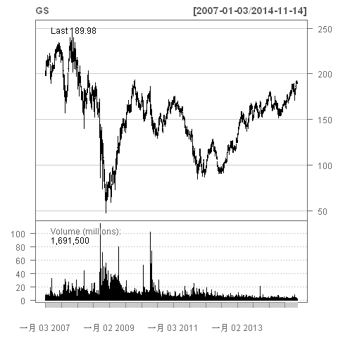
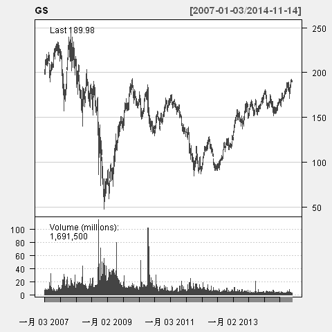
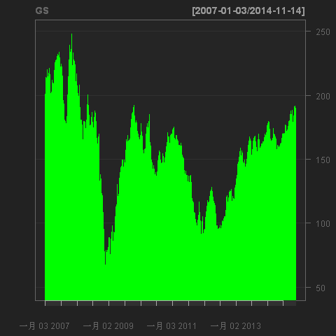

## 3 图形分析

### 3.1 基本画图函数

#### chartSeries


chartSeries()函数是quantmod包的主绘图函数。

该函数的主要参数有：

* x：时序数据
* type:画图的类型
* TA：技术分析指标
* pars:图形参数
* theme:主题

比如：

``` r
> getSymbols("GS") #Goldman OHLC from yahoo 
[1] "GS"
> chartSeries(GS) 
```


#### reChart

reChart()是一个重新绘图函数。

```r
chartSeries(GS) 
reChart(major.ticks='months',subset='first 16 weeks') 
```

### 3.2 三种基本图形
#### 条形图

```r
barChart(GS,theme='white.mono',bar.type='hlc')
```


#### 蜡烛图

```r
candleChart(GS,multi.col=TRUE,theme='white') 
candleChart(GS,multi.col=T,theme="white")
```

#### 线图

```r
lineChart(GS)
lineChart(GS,theme="white")
lineChart(GS,line.type='h',TA=NULL) 
```


### 3.3 修饰图形

通过chartSeries中的图形参数还可以对图形进行修饰。

#### 修饰图形

``` r
## 将图形主题修改为white
chartSeries(GS,theme="white") 
```

#### 定制绘图主题

chartTheme()函数可以绘图主题：

* fg.col:前景色
* bg.col:背景色
* grid.col:网格线颜色
* border:框线颜色
* minor.tick:最小刻度标记的颜色
* major.tick:最大刻度标记的颜色
* up.col:上涨日对应的条形或蜡烛图颜色
* dn.col:下跌日对应的条形或蜡烛图颜色
* up.up.col:连续上涨日的条形或者蜡烛图颜色
* up.dn.col:先涨后跌日的条形或者蜡烛图颜色
* dn.dn.col:连续下跌日的条形或者蜡烛图颜色
* dn.up.col:先跌后涨日的条形或者蜡烛图颜色
* up.border:上涨日对应的条形或者蜡烛图边框线颜色
* dn.border:下跌日对应的条形或者蜡烛图边框线颜色
* up.up.border:连续上涨日对应的条形或者蜡烛图颜色
* up.dn.border:先涨后跌日对应的条形或者蜡烛图颜色
* dn.dn.border:连续下跌日对应的条形或者蜡烛图颜色
* dn.up.border:先跌后涨日对应的条形或者蜡烛图颜色

比如：

``` r
chartTheme()
chartTheme('white')
chartTheme('white',up.col='blue',dn.col='red')

# A TA example
chartTheme(addRSI.col='red')

str(chartTheme())
```

### 3.4 图形缩放

``` r
> zooom(n=1, eps=2)
select left and right extremes by clicking the chart
done
> zoomChart(subset, yrange=NULL)
> zoomChart("2013::", yrange=NULL)
> zoomChart("2014::", yrange=NULL)
> zoomChart("2014-06::", yrange=NULL)
```
### 3.5 技术分析图形

``` r
require(TTR)
```

* 平均趋向指标ADX: addADX

``` r
addADX()
```

* 平均真实波幅指标ATR

``` r
addATR()
```

* 布林线指标BBands

``` r
addBBands()
```

* 顺势指标CCI

``` r
addCCI()
```

* Chaikin资金流量指标CMF

``` r
addCMF()
```

* Chande动量摆动指标CMO

``` r
addCMO()
```

* 指数平均数指标EMA

``` r
addEMA()
```

* 包络线指标Envelope

``` r
addEnvelope()
```

* 弹性成交量加权移动平均线指标EVWMA

``` r
addEVWMA ()
```

* 移动平均收敛发散指标MACD

``` r
addMACD ()
```

* 动量指标Momentum

``` r
addMomentum ()
```

* 合约终止线Expiry

``` r
addExpiry()
```

* 抛物线指标SAR
 
``` r
addSAR()
```

* 简单移动平均指标SMA

``` r
addSMA()
```

* 随机动量指标SMI

``` r
addSMI()
```

* 双指数移动平均指标DEMA
 
``` r
addDEMA()
```

* 区间震荡线DPO

``` r
addDPO()
```

* 变动率指标ROC

``` r
addROC ()
```

* 相对强弱指标RSI

``` r
addRSI()
```

* 交易量指标Vo

``` r
addVo()
```

* 加权移动平均线指标WMA

``` r
addWMA()
```

* 威廉指标WPR

``` r
addWPR()
```

* 零滞后指数移动平均ZLEMA

``` r
addZLEMA()
```

* 辅助函数
  * addTA()
  * newTA()
  * setTA(type = c("chartSeries", "barChart", "candleChart"))
  * listTA(dev)

### 3.6  图形存储

``` r
getSymbols("AAPL")
chartSeries(AAPL)
require(TTR)
addBBands()
saveChart('pdf')
saveChart('pdf', width=13)
```
